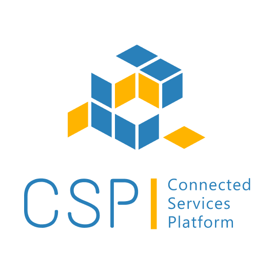

[](./images/logo.png)

[](https://github.com/eclipse-ecsp/uidam-user-management/actions/workflows/maven-build.yml)
[](https://github.com/eclipse-ecsp/uidam-user-management/actions/workflows/licence-compliance.yaml)
[](https://sonarcloud.io/summary/new_code?id=eclipse-ecsp_uidam-user-management)
[](https://github.com/eclipse-ecsp/uidam-user-management/releases)

# UIDAM-User-Management
This is UIDAM-User-Management microservice to handle scope, role, user and client CRUD operations for user profile, clients registrations, roles, scopes, etc.

# Table of Contents
* [Getting Started](#getting-started)
* [Usage](#usage)
* [How to contribute](#how-to-contribute)
* [Built with Dependencies](#built-with-dependencies)
* [Code of Conduct](#code-of-conduct)
* [Authors](#authors)
* [Security Contact Information](#security-contact-information)
* [Support](#support)
* [Troubleshooting](#troubleshooting)
* [License](#license)
* [Announcements](#announcements)
* [Acknowledgments](#acknowledgments)

## Getting Started
To build the project in the local working directory after the project has been cloned/forked, run:

```mvn clean install```

from the command line interface.

### Prerequisites

1. PostgreSQL Installation and a Database manager tool like DBeaver to handle db transactions when required over Local
   environment.
2. DB Setup by following steps mentioned in [Local DB Setup](#local-db-setup)
3.  There would be interaction required with UIDAM Authorization server for token generation and revoke tokens, update the property AUTHORIZATION_SERVER_URL, postgres.username, postgres.password in [application.properties](src/main/resources/application.properties) accordingly.
4. Install Postman locally for running curl commands
5. Maven version 3.6 or higher
6. Java version 17

### Installation

[How to set up maven](https://maven.apache.org/install.html)

[Install Java](https://stackoverflow.com/questions/52511778/how-to-install-openjdk-11-on-windows)

#### Local DB Setup

1. Install PostgreSQL and a Database manager tool like [DBeaver](https://dbeaver.com/2022/02/17/how-to-download-and-install-dbeaver/)
2. If it is a fresh installation then need to create uidam_management database and uidam schema in uidam_management database before running the application.
3. Steps to create db and schema(fresh installation)
   1. Drop role if exist - DROP ROLE IF EXISTS uidam_management;
   2. Create a user for db - create user uidam_management with password  'uidam_management';
   3. alter user uidam_management CREATEDB;
   4. Create database - CREATE DATABASE uidam_management owner  uidam_management;
   5. \c uidam_management;
   6. Check all schema exists in db - \dn
   7. Create schema - CREATE SCHEMA IF NOT EXISTS uidam;
4. Steps to create schema in case db already exists but schema is not exist:
   1. Check all schema exists in db - \dn
   2. Create schema - CREATE SCHEMA IF NOT EXISTS uidam;
5. When the application is run, Liquibase will take care of creating tables in the schema and populating with default data.


#### Build

Run mvn clean install

#### How to Test on Local

1. Run the Application by running the main class [UidamAuthorizationServerApplication.java](./src/main/java/com/harman/uidam/UidamUserManagementApplication.java)
2. As Liquibase in included in the project, so it would take care of tracking, managing and applying database schema changes along with default data creation.
3. Run local curl commands in postman as described in [Usage Section](#usage) using the default credentials as shared in the [Default Data Section](#default-data)

### Coding style check configuration

[checkStyle.xml](./checkStyle.xml) is the coding standard to follow while writing new/updating existing code.

Checkstyle plugin [maven-checkstyle-plugin:3.2.1](https://maven.apache.org/plugins/maven-checkstyle-plugin/) is integrated in [pom.xml](./pom.xml) which runs in the `validate` phase and `check` goal of the maven lifecycle and fails the build if there are any checkstyle errors in the project.

To run checkstyle plugin explicitly, run the following command:

```mvn checkstyle:check```

### Running the tests

```mvn test```

Or run a specific test

```mvn test -Dtest="TheFirstUnitTest"```

To run a method from within a test

```mvn test -Dtest="TheSecondUnitTest#whenTestCase2_thenPrintTest2_1"```

## Usage
The UIDAM User Management microservice offers comprehensive functionality for managing scopes, roles, client registrations, cloud profiles and user profiles. 
Additionally, it supports various user operations such as changing user status, locking users, resetting user passwords using secrets, etc.
It provides the following services:
1. User management:
   * All CRUD operations for users
   * Filter users based on some specifications
   * Revoke user tokens
   * Reset user password
   * Lock users
   * Change user status
2. Client Management services:
   * All CRUD operations for clients
3. Scopes Management services:
    * All CRUD operations for scopes
4. Roles Management services:
   * All CRUD operations for roles
5. Cloud Profile services:
    * All CRUD operations for cloud profiles


#### Predefined Scopes and Roles
Following Scopes and Roles are created by the Liquibase scripts, and can be used for api invocation. Rest of the default data can be checked directly in the [inital_schema.xml](src/main/resources/database.schema/changesets/1_0_release/initial_schema.xml) file.

| Table Name     | Predefined Data                                                                                                                                                     |
|:---------------|:--------------------------------------------------------------------------------------------------------------------------------------------------------------------|
| `scope` | `SelfManage` `ViewUsers` `ManageUsers` `ManageUserRolesAndPermissions` `RevokeToken` `ManageAccounts` `ViewAccounts` `UIDAMSystem` `IgniteSystem` `OAuth2ClientMgmt`  |
| `role`  | `VEHICLE_OWNER` `BUSINESS_ADMIN` `TENANT_ADMIN`                                                                                                                     |

#### Authorization Server
For generating token, please refer to the details in the [uidam-authorization-server](https://github.com/eclipse-ecsp/uidam-authorization-server) repository


### Curl Commands

| Feature                             | Curl                                                                                                                                                                                                                                                                                                                                                                                                                                                                                                                                                                                                                                                                                                                           
|:------------------------------------|:-------------------------------------------------------------------------------------------------------------------------------------------------------------------------------------------------------------------------------------------------------------------------------------------------------------------------------------------------------------------------------------------------------------------------------------------------------------------------------------------------------------------------------------------------------------------------------------------------------------------------------------------------------------------------------------------------------------------------------|
| Client Credentials Token Generation | ```curl --location '<AUTHORIZATION_SERVER_URL>/oauth2/token' --header 'content-type: application/x-www-form-urlencoded' --data-urlencode 'grant_type=client_credentials' --data-urlencode 'scope=<SCOPE_NAME>' --data-urlencode 'client_id=<CLIENT_ID>' --data-urlencode 'client_secret=<CLIENT_SECRET>'  {"access_token": <ACCESS_TOKEN>,"scope": <COMMA_SEP_LIST_OF_SCOPES>,"token_type": "Bearer","expires_in": 499}```                                                                                                                                                                                                                                                                                                          |
| Create Scope /v1/scopes             | ```curl -X POST "http://localhost:8080/v1/scopes" -H "accept: application/json" -H "authorization: <ACCESS_TOKEN>"  -H "content-type: application/json" -H "user_id: <USER_ID>" -d '{"name":<SCOPE_NAME>,"description":"This scope will allow user to manage all users.","administrative":false}'```                                                                                                                                                                                                                                                                                                                                                                                                                           |
| Get Scope /v1/scopes/{scope}        | ```curl -X GET "http://localhost:8080/v1/scopes/scopeName" -H "accept: application/json" -H "authorization: <ACCESS_TOKEN>"```                                                                                                                                                                                                                                                                                                                                                                                                                                                                                                                                                                                                 |
| Update Scope /v1/scopes             | ```curl -X PATCH "http://localhost:8080/v1/scopes/scopeName" -H "accept: application/json" -H "authorization: <ACCESS_TOKEN>" -H "content-type: application/json" -H "user_id: <USER_ID>" -d '{"description":"Updated description","administrative":false}'```                                                                                                                                                                                                                                                                                                                                                                                                                                                                 |
| Delete Scope /v1/scopes             | ```curl -X DELETE "http://localhost:8080/v1/scopes/scopeName" -H "accept: application/json" -H "authorization: <ACCESS_TOKEN>" -H "user_id: <USER_ID>"```                                                                                                                                                                                                                                                                                                                                                                                                                                                                                                                                                                      |
| Filter Scope /v1/scopes/filter      | ```curl -X POST "http://localhost:8080/v1/scopes/filter?pageSize=20" -H "accept: application/json" -H "authorization: <ACCESS_TOKEN>" -H "content-type: application/json" -d '{"scopes":[<COMMA_SEP_LIST_OF_SCOPES>]}'```                                                                                                                                                                                                                                                                                                                                                                                                                                                                                                                |
| Create Role /v1/roles               | ```curl -X POST "http://localhost:8080/v1/roles" -H "accept: application/json" -H "authorization: <ACCESS_TOKEN>" -H "content-type: application/json" -H "user_id: <USER_ID>" -d '{"name":<ROLE_NAME>,"description":<ROLE_DESCRIPTION>,"scopeNames":[<COMMA_SEP_LIST_OF_SCOPES>]}'```                                                                                                                                                                                                                                                                                                                                                                                                                                          |
| Get Role By Name /v1/roles/{role}   | ```curl -X GET "http://localhost:8080/v1/roles/<ROLE_NAME>" -H "accept: application/json"  -H "authorization: <ACCESS_TOKEN>"```                                                                                                                                                                                                                                                                                                                                                                                                                                                                                                                                                                                               | 
| Get Role By Id /v1/roles/roleById   | ```curl -X POST "http://localhost:8080/v1/roles/rolesById" -H "accept: application/json" -H "authorization: <ACCESS_TOKEN>" -H "content-type: application/json" -d '{"roleId":[<COMMA_SEP_LIST_OF_ROLE_IDS>]}'```                                                                                                                                                                                                                                                                                                                                                                                                                                                                                                              |
| Update Role /v1/roles/{role}        | ```curl -X PATCH "http://localhost:8080/v1/roles/{roleName}" -H "accept: application/json" -H "authorization: <ACCESS_TOKEN>" -H "content-type: application/json" -H "user_id: <USER_ID>" -d '{"description":"new updated description","scopeNames":[<COMMA_SEP_LIST_OF_SCOPES>]}'```                                                                                                                                                                                                                                                                                                                                                                                                                                          |
| Filter Role /v1/roles/filter        | ```curl -X POST "http://localhost:8080/v1/roles/filter?pageSize=20" -H "accept: application/json" -H "authorization: <ACCESS_TOKEN>" -H "content-type: application/json" -d '{"roles":[<COMMA_SEP_LIST_OF_ROLES>]}'```                                                                                                                                                                                                                                                                                                                                                                                                                                                                                                         |
| Create User	                        | ```curl -X POST "http://localhost:8080/v1/users" -H "accept: application/json" -H "authorization: <ACCESS_TOKEN>" -H "content-type: application/json" -d '{"firstName":"John","lastName":"Doe","country":"USA","state":"Illinois","city":"Chicago","address1":"5801","address2":"S Ellis Ave","postalCode":"560068","phoneNumber":"+17535011234","email":"john.doe1@domain.com","gender":"MALE","birthDate":"1997-10-13","locale":"en_US","notificationConsent":true,"timeZone":"IST","userName":"johnd","password":"Lakshmi@202","roles":[<COMMA_SEP_LIST_OF_ROLES>],"status":"ACTIVE","aud":"k8-qa-dmportal","is_external_user":true,"captchaRequired":true}'```                                                             |
| Get User By Filter                  | ```curl -X POST "http://localhost:8080/v1/users/filter?pageSize=20" -H "accept: application/json" -H "authorization: <ACCESS_TOKEN>" -H "content-type: application/json" -d '{"userNames":["admin"]}'```                                                                                                                                                                                                                                                                                                                                                                                                                                                                                                                       |
| Get a user by ID                    | ```curl -X GET "http://localhost:8080/v1/users/{userId}" -H "accept: application/json" -H "authorization: <ACCESS_TOKEN>"```                                                                                                                                                                                                                                                                                                                                                                                                                                                                                                                                                                                                   |
| Update User                         | ```curl -X PATCH "http://localhost:8080/v1/users/{userId}" -H "accept: application/json" -H "authorization: <ACCESS_TOKEN>" -H "content-type: application/json" -d '{"firstName":"john"}'```                                                                                                                                                                                                                                                                                                                                                                                                                                                                                                                                   |
| Delete a User                       | ```curl -X DELETE "http://localhost:8080/v1/users/{userId}" -H "accept: application/json" -H "authorization: <ACCESS_TOKEN>"```                                                                                                                                                                                                                                                                                                                                                                                                                                                                                                                                                                                                |
| Get Self User                       | ```curl -X GET "http://localhost:8080/v1/users/self" -H "accept: application/json" -H "authorization: <ACCESS_TOKEN>" -H "user_id: <USER_ID>"```                                                                                                                                                                                                                                                                                                                                                                                                                                                                                                                                                                               |
| Update Self User                    | ```curl -X PATCH "http://localhost:8080/v1/users/self" -H "accept: application/json" -H "authorization: <ACCESS_TOKEN>" -H "content-type: application/json" -H "user_id: <USER_ID>" -d '{"firstName":"john"}'```                                                                                                                                                                                                                                                                                                                                                                                                                                                                                                               |
| Delete Self User                    | ```curl -X DELETE "http://localhost:8080/v1/users/self" -H "accept: application/json" -H "authorization: <ACCESS_TOKEN>" -H "user_id: <USER_ID>"```                                                                                                                                                                                                                                                                                                                                                                                                                                                                                                                                                                            |
| Change user status                  | ```curl -X PATCH "http://localhost:8080/v1/users/status" -H "accept: application/json" -H "authorization: <ACCESS_TOKEN>" -H "content-type: application/json" -d '{"ids":[<USER_ID>],"approved":false}'```                                                                                                                                                                                                                                                                                                                                                                                                                                                                                                                     |
| Create v2 user | ```curl --location --request POST 'http://localhost:8080/v2/users' --header 'accept: application/json' --header 'content-type: application/json' --header 'user_id: <USER_ID>' --header 'Authorization: <ACCESS_TOKEN>' --data-raw '{ "firstName": "John", "lastName": "Doe", "country": "IN", "city": "BLR", "email": "abc@example.com","gender": "MALE","locale": "en_US","notificationConsent": true,"timeZone": "IST","userName": "testuser","password": "Harman@2024","aud": "test-portal","accounts": [{"account": "test_abhi1","roles": ["BUSINESS_ADMIN"]}],"is_external_user": false}'``` |
| Get v2 user | ```curl --location 'http://localhost:8080/v2/users/<USER_ID>' --header 'accept: application/json' --header 'Authorization: <ACCESS_TOKEN>'``` |
| Filter v2 user | ```curl --location 'http://localhost:8080/v2/users/filter?pageSize=200&searchType=CONTAINS' --header 'accept: application/json' --header 'Authorization: <ACCESS_TOKEN>' --data '{"status": ["ACTIVE"]}'``` |
| Update v2 user | ```curl --location --request PATCH 'http://localhost:8080/v2/users/<USER_ID>' --header 'accept: application/json' --header 'content-type: application/json' --header 'Authorization: <ACCESS_TOKEN>' --data '[{"op":"add","path":"/account/<ACCOUNT_ID>/roleName","value": "VEHICLE_OWNER"}]'``` |
| Client Registration GET             | ```curl -X GET "http://localhost:8080/v1/oauth2/client/{clientId}" --header 'Accept-Encoding:application/json' --header 'Content-Type:application/json' --header 'Authorization:<ACCESS_TOKEN>'``` |
| Client Registration POST            | ```curl --location --request POST "http://localhost:8080/v1/oauth2/client" --header 'Accept-Encoding:application/json' --header 'Content-Type:application/json' --header 'Authorization:<ACCESS_TOKEN>' --data-raw '{"clientId":"<CLIENT_ID>","clientSecret":"<CLIENT_SECRET>","clientName":"<CLIENT_NAME>","authorizationGrantTypes":["client_credentials","authorization_code","refresh_token"],"redirectUris":["<AUTHORIZATION_SERVER_URL>/login"],"scopes":[<COMMA_SEP_LIST_OF_SCOPES>],"requireAuthorizationConsent":false,"accessTokenValidity":3600,"authorizationCodeValidity":1000,"additionalInformation":"{\"test\":\"test1\"}","refreshTokenValidity":1000,"requestedBy":"test-component","status":"approved"}'``` |
| Client Registration PUT API         | ```curl -X PUT "http://localhost:8080/v1/oauth2/client/{clientId}" --header 'Accept-Encoding:application/json' --header 'Content-Type:application/json' --header 'Authorization:<ACCESS_TOKEN>' --data-raw '{"clientId":"<CLIENT_ID>","clientSecret":"<CLIENT_SECRET>","clientName":"<CLIENT_NAME>","authorizationGrantTypes":["client_credentials","authorization_code","refresh_token"],"redirectUris":["<AUTHORIZATION_SERVER_URL>/login"],"scopes":[<COMMA_SEP_LIST_OF_SCOPES>],"requireAuthorizationConsent":false,"accessTokenValidity":3600,"authorizationCodeValidity":1000,"additionalInformation":"{\"test\":\"test1\"}","refreshTokenValidity":1000,"requestedBy":"test-component","status":"approved"}'```         |
| Client Registration DELETE API      | ```curl -X DELETE "http://localhost:8080/v1/oauth2/client/{clientId}" --header 'Accept-Encoding:application/json' --header 'Content-Type:application/json' --header 'Authorization:<ACCESS_TOKEN>'```|    | Create Account | ```curl --location 'http://localhost:8080/v1/accounts' --header 'user-id: 1' --header 'Content-Type: application/json'--header 'Authorization:<ACCESS_TOKEN> ' --data '{"accountName": "userdefaultaccount", "roles": []}'```  |
| GET Account | ```curl --location 'http://localhost:8080/v1/accounts/<ACCOUNT_ID>' --header 'accept: application/json' --header 'user-id: 1' --header 'Authorization:<ACCESS_TOKEN>'``` |
| Filter Account | ```curl --location 'http://localhost:8080/v1/accounts/filter?searchMode=CONTAINS' --header 'accept: application/json' --header 'user-id: 1' --header 'Content-Type: application/json' --header 'Authorization:<ACCESS_TOKEN>' --data '{"status": ["ACTIVE"]}''``` | 
| Filter Account | ```curl --location 'http://localhost:8080/v1/accounts/filter?searchMode=CONTAINS' --header 'accept: application/json' --header 'user-id: 1' --header 'Content-Type: application/json' --header 'Authorization:<ACCESS_TOKEN>' --data '{"status": ["ACTIVE"]}''``` | 
| Associate Account to user | ```curl --location --request PATCH 'http://localhost:8080/v1/users/<USER_ID>/accountRoleMapping' --header 'accept: application/json' --header 'content-type: application/json' --header 'Authorization:<ACCESS_TOKEN>' --data '[{"op": "add","path": "/account/","value": "<ACCOUNT_ID>"  }]'``` |
| Remove Account from user | ```curl --location --request PATCH 'http://localhost:8080/v1/users/<USER_ID>/accountRoleMapping' --header 'accept: application/json' --header 'content-type: application/json' --header 'Authorization:<ACCESS_TOKEN>' --data '[{"op": "remove","path": "/account/","value": "<ACCOUNT_ID>"  }]'``` |

Note: Replace the placeholders with actual values. The above shared curls are for localhost, please replace "localhost" with the actual server URL.

### JKS Generation Steps
* Make sure you have Java installed in your system
* Open CMD
* Go to <Java Installation Folder>\bin
* Use the following command:
   `keytool -genkey -alias <alias_name> -keyalg RSA -keypass <key-password> -storepass <store-password> -keystore <full path where jks to be stored along with jks file name>.jks -validity <validity period in days> -keysize  4096`
* Add required details
* Jks file would be created
* Encoded jks has to be used in uidam chart, so use the following command to generate the same
   To encode jks -> `cat <jks-file-name>.jks | base64 -w 0`
* Update encrypted value in values.yaml (`jks_file`) of uidam-authorization-server charts.
  ex: Source of values.yaml - jks_file
* Along with jks, update the chart with jks alias (`values.yaml -> keyAlias`) and jks password (`secrets.yaml -> keystorePassword`).

#### Glossary
* CLIENT_REGISTRATION_SECRET_KEY - Client registration secret key for encryption
* CLIENT_ID, clientId - Registered Client ID
* CLIENT_SECRET - Registered Client Secret
* CLIENT_REGISTRATION_SECRET_SALT -  Client registration secret salt for encryption
* ACCESS_TOKEN - Access Token
* AUTH_SERVER_REVOKE_TOKEN_URL - Revoke user/client token endpoint 
* AUTH_SERVER_TOKEN_URL - Token generation endpoint
* USER_ID, userId - User ID
* COMMA_SEP_LIST_OF_SCOPES - Comma separated list of scopes like "ScopeA,ScopeB"
* COMMA_SEP_LIST_OF_ROLE_IDS - Comma separated list of role ids like "RoleA,RoleB"
* ROLE_NAME, roleName - Role name
* SCOPE_NAME - Scope name
* ROLE_DESCRIPTION - Role description

## Built With Dependencies

* [SQL DAO](https://github.com/eclipse-ecsp/sql-dao) - SQL DAO to manage database transactions
* [Spring Boot](https://spring.io/projects/spring-boot/) - The web framework used
* [Maven](https://maven.apache.org/) - Build tool used for dependency management
* [PostgreSQL](https://www.postgresql.org/) - Relational database
* [Spring Framework](https://spring.io/projects/spring-framework) - Web framework used for building the application.
* [Junit](https://junit.org/junit5/) - Unit testing framework.
* [Mockito](https://site.mockito.org/) - Mocking framework for testing.
* [Java 17](https://www.oracle.com/java/technologies/javase/jdk17-archive-downloads.html) - Java version
* [Liquibase](https://www.liquibase.org/) - Manages database schema changes.
* [Lombok](https://projectlombok.org/) - Auto-generates Java boilerplate code (e.g., getters, setters, builders).
* [Thymeleaf](https://www.thymeleaf.org/) - Template Engine
* [SnakeYAML](https://bitbucket.org/snakeyaml/snakeyaml) - YAML parser
* [Logback](http://logback.qos.ch/) -Concrete logging implementation used with SLF4J.
* [SLF4J](http://www.slf4j.org/) -  Logging facade providing abstraction for various logging frameworks.

## How to contribute

Please read [CONTRIBUTING.md](./CONTRIBUTING.md) for details on our contribution
guidelines, and the process for submitting pull requests to us.

## Code of Conduct

Please read [CODE_OF_CONDUCT.md](./CODE_OF_CONDUCT.md) for details on our code of conduct,
and the process for submitting pull requests to us.

## Contributors

Check here the list of [contributors](https://github.com/eclipse-ecsp/uidam-authorization-server/graphs/contributors) who participated in this project.

## Security Contact Information

Please read [SECURITY.md](./SECURITY.md) to raise any security related issues.

## Support

Please write to us at [csp@harman.com](mailto:csp@harman.com)

## Troubleshooting

Please read [CONTRIBUTING.md](./CONTRIBUTING.md) for details on how to raise an issue and submit a pull request to us.

## License

This project is licensed under the Apache-2.0 License - see the [LICENSE](./LICENSE) file for details

## Announcements

All updates to this component are present in our [releases page](https://github.com/eclipse-ecsp/uidam-user-management/releases).
For the versions available, see the [tags on this repository](https://github.com/eclipse-ecsp/uidam-user-management/tags).
